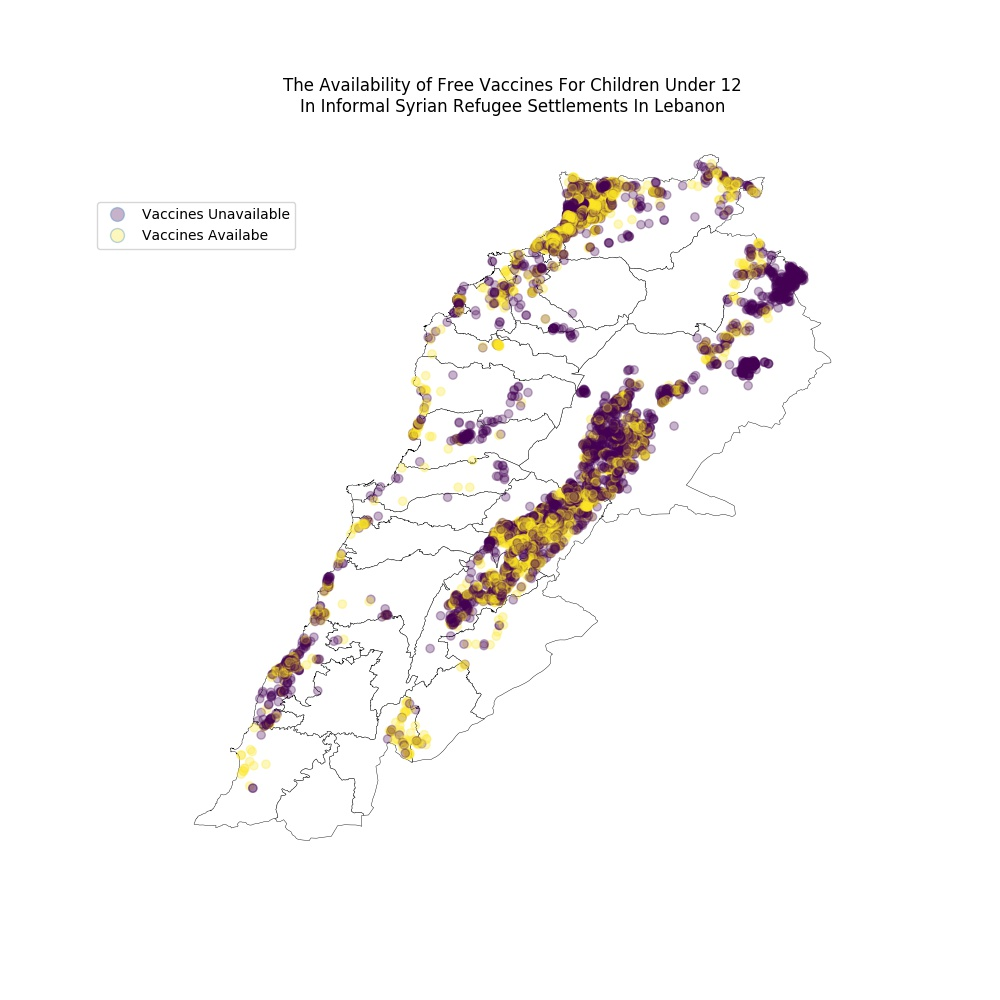

# Brief:

I have worked on this homework alone

I asked for the 72 hr extension for this HW

# Assignment 1:

timeseries and random forest trees

# Assignment 2:

I improved my visualization according to my classmates recommendatiosn:

set alpha for the location of settelements and reduce line width of the map

