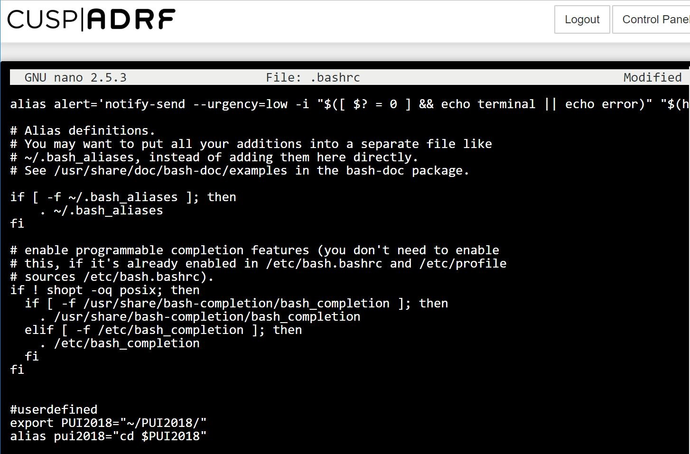
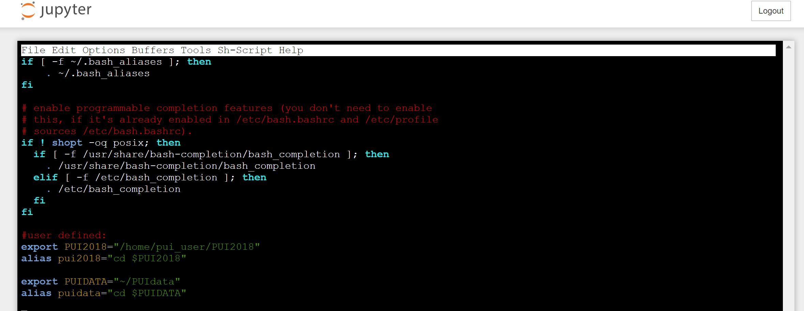
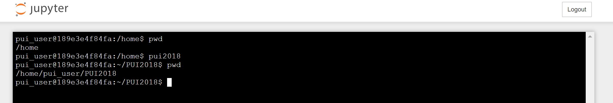

# Steps I took to set my environment:

## On the CUSP|ADRF terminal:

1. Created a directory named PUI2018
```
mkdir PUI2018
```
2. Opened my .bashrc file
```
nano .bashrc
```
3. Added the following to end of the file:

export PUI2018="~/PUI2018"

alias pui2018="cd $PUI2018"



4. Reload the .bashrc file to read and execute the new commands

```
source .bashrc
```
5. Check if my environment is set


## After installing Docker toolbox:

I followed the same steps above, however I used emacs editor instead of nano.





## Set Environment Variables on a Windows Machine:

I also figured out how to set environment variables from the terminal on my windows machine.

1. Created a directory **PUI2018** on my computer 
```
mkdir PUI2018 
OR 
md PUI2018 
```
2. Created an temporary environment variable **PUI2018** that points to that directory
```
set PUI2018 = C:\Users\linda\Documents\GitHub\PUI2018
```

   ** Note**: To save an environment variable permanently I had to write the same line of code in a file. Since windows don't have a .bashrc file, I created a batch (.bat or .cmd) file that will have all the commands that I want to execute upon cmd startup.

3. Created a **.bat** file and named it autorun.bat

   To do that I created a .text file and then changed the extention to .bat

4. Edited that .bat file adding the following:

   :: User defined  
   echo off  
   set PUI2018 = C:\Users\linda\Documents\GitHub\PUI2018  
   doskey pui2018 = cd C:\Users\linda\Documents\GitHub\PUI2018

5. Opened Run by pressing windows key + r and typed regedit to open Registry Editor

6. In the left pane, navigated to HKEY_CURRENT_USER\Software\Microsoft\Command Processor

7. In the right pane, right click and select String, this adds a new key into the registry.

8. Named it AutoRun (mind caps)

9. Double click AutoRun and added the path to my .bat file in the value 


Sources: https://nitin09.wordpress.com/2013/11/12/bashrc-in-windows-for-command-line-startup/
    
    
      
    
