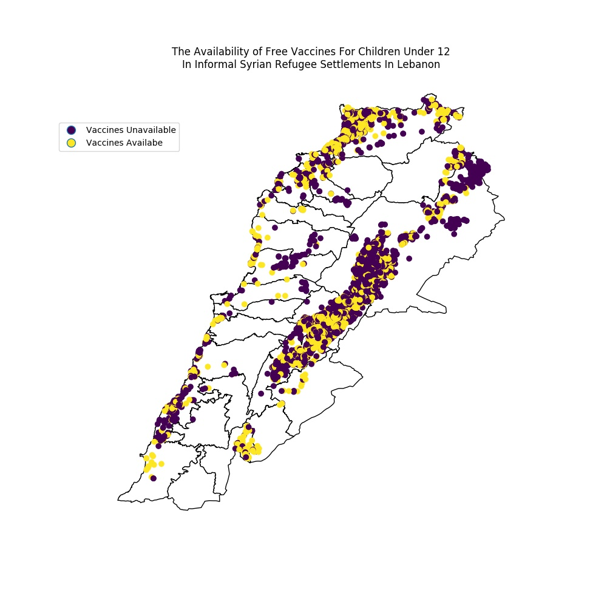

# Linda Jaber's plot review, by Pablo Mandiola

## Plot

**The figure above is a map of Lebanon showing the boundaries of Cazas or Districts.
The locations of informal syrian refugee settlements are plotted on the map.
This shows us how the settlements are concentrated in the east districts of the country as well as in those in the north.
The locations are color coded by the availability of free vaccines for children under 12 years old,
where dark circles indicate unavailability. We notice that a significant number of settlements lacking vaccination.**

## Review
